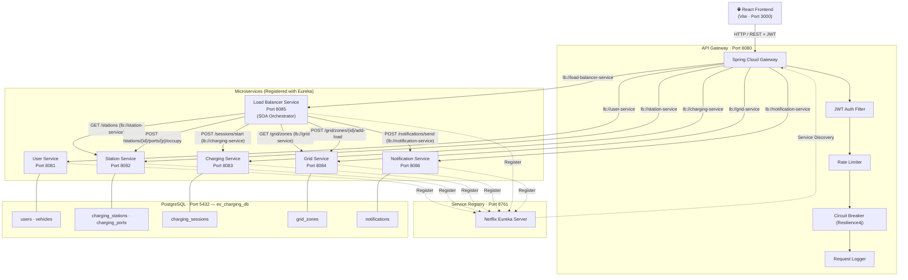
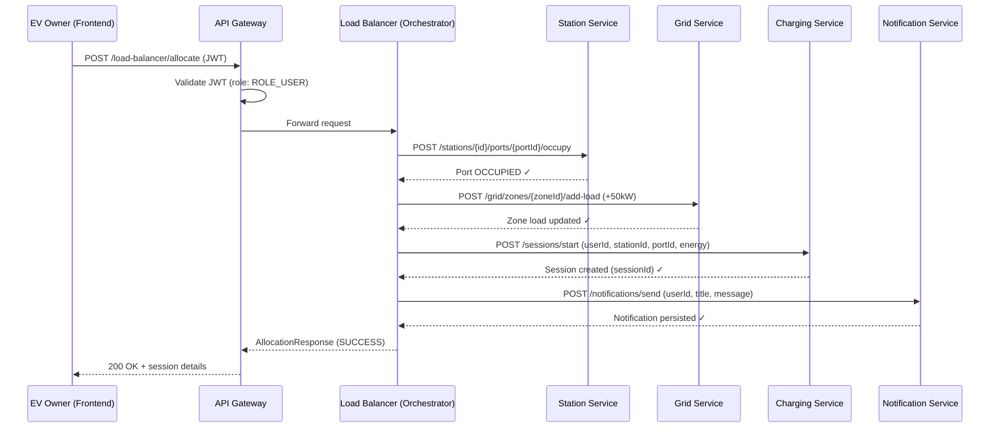

# System Architecture
## Distributed EV Charging Station & Grid Load Balancing Platform
**PS046 — Service-Oriented Architecture (SOA)**

---

## 1. Architecture Overview

This platform follows a **Service-Oriented Architecture (SOA)** implemented as a suite of independently deployable **Spring Boot microservices**. All client traffic enters through a single **API Gateway**, which validates JWT tokens and routes requests to downstream services discovered dynamically via a **Netflix Eureka Service Registry**.

The centrepiece of the SOA design is the **Load Balancer Service**, which acts as a pure *SOA Orchestrator* — it holds no domain data of its own and instead composes calls to four other services to fulfil a smart charging allocation request.

---

## 2. Service Catalogue & Responsibilities

| Service | Port | Responsibility | Database |
|---|---|---|---|
| **Service Registry** | 8761 | Netflix Eureka Server — dynamic service registration and discovery | None |
| **API Gateway** | 8080 | JWT validation, request routing via Eureka (`lb://`), CORS, rate limiting, circuit breakers | None |
| **User Service** | 8081 | User registration/authentication, JWT issuance, profile management, EV vehicle registry | `users`, `vehicles` tables |
| **Station Service** | 8082 | EV station catalog, port availability, port occupation/release | `charging_stations`, `charging_ports` tables |
| **Charging Service** | 8083 | Charging session lifecycle (start, active, stop, billing, history) | `charging_sessions` table |
| **Grid Service** | 8084 | Grid zone data, real-time load monitoring, overload detection | `grid_zones` table |
| **Load Balancer Service** | 8085 | SOA Orchestrator — evaluates candidates by grid load score, coordinates allocation across 4 services | None (stateless) |
| **Notification Service** | 8086 | Stores and retrieves per-user alert messages dispatched by the orchestrator | `notifications` table |

---

## 3. System Architecture Diagram



---

## 4. SOA Orchestration Flow — Smart Charging Allocation

The following sequence shows the **SOA composition** performed by the Load Balancer during a smart allocation request (`POST /load-balancer/allocate`):



---

## 5. Service Boundary Analysis

### Boundary Evaluation (SOA Principle: Single Responsibility)

| Service | Owns | Does NOT Own |
|---|---|---|
| User Service | User identity, authentication, JWT issuance, vehicle registry | Session data, station data, billing |
| Station Service | Station catalog, port inventory, port state transitions | Grid state, billing, user identity |
| Charging Service | Session records, billing calculations, session lifecycle | Port state, grid state, notifications |
| Grid Service | Grid zone definitions, real-time load values, status computation | Station assignment, session records |
| Load Balancer Service | Orchestration logic, scoring algorithm, multi-service composition | No persistent data; stateless |
| Notification Service | Alert message storage and retrieval | Delivery channels (email, SMS) — not implemented |

### Boundary Violation Audit
✅ **No boundary violations found.** The Load Balancer calls other services exclusively via REST API — it does not access any other service's database directly.

---

## 6. Inter-Service Communication

| Pattern | Mechanism | Used By |
|---|---|---|
| Client → Backend | REST/HTTP + JWT Bearer Token | React frontend → API Gateway |
| Gateway → Service | Eureka `lb://` service discovery + Spring Cloud LoadBalancer | All routes in API Gateway |
| Orchestrator → Services | `@LoadBalanced RestTemplate` with `lb://service-name` URIs | Load Balancer → Station, Grid, Charging, Notification Services |
| Service → Eureka | Netflix Eureka Client heartbeat (every 30s) | All 6 microservices |

### Why `lb://` matters
Using `lb://station-service` (instead of `http://localhost:8082`) means:
1. The request goes through Spring Cloud LoadBalancer, which queries Eureka for all healthy instances.
2. If multiple instances of `station-service` are running, traffic is distributed automatically (Round Robin by default).
3. If an instance goes down, Eureka deregisters it and requests are never sent to it.

---

## 7. Security Architecture

```
Request Flow Through Gateway:
────────────────────────────────────────────────────────────
Client Request (with Bearer token)
    │
    ▼
JwtAuthenticationFilter (GlobalFilter, Order -1)
    │  Extract Authorization header
    │  ├─ Missing/invalid → 401 Unauthorized
    │  ├─ On whitelist (/users/login, /users/register) → PASS
    │  └─ Valid JWT → extract username + role, set headers
    │
    ▼
RateLimiter Filter (per principal)
    │  Exceeds 10 req/s → 429 Too Many Requests
    │
    ▼
CircuitBreaker Filter (Resilience4j)
    │  Downstream DOWN → Fallback response (503 + JSON)
    │
    ▼
GatewayLoggingFilter (GlobalFilter, Order 1)
    │  Log: method, path, status, duration
    │
    ▼
Route to downstream service via lb://
```

---

## 8. Health Check Architecture

All 6 microservices expose Spring Boot Actuator endpoints:

| Endpoint | Response |
|---|---|
| `GET /actuator/health` | `{"status":"UP"}` — used by Eureka for instance health |
| `GET /actuator/info` | Application name and version |

Eureka uses the heartbeat mechanism (30-second intervals) combined with the Actuator health endpoint to determine instance availability. Instances that fail to renew within 90 seconds are automatically evicted.

---

## 9. Technology Stack

| Layer | Technology | Version |
|---|---|---|
| Service Framework | Spring Boot | 3.1.5 |
| Service Discovery | Spring Cloud Netflix Eureka | 2022.0.4 |
| API Gateway | Spring Cloud Gateway (Reactive) | 2022.0.4 |
| Circuit Breaker | Resilience4j | Bundled with Spring Cloud |
| Service-to-Service LB | Spring Cloud LoadBalancer | 2022.0.4 |
| Authentication | JJWT (io.jsonwebtoken) | 0.11.5 |
| Password Hashing | Spring Security Crypto (BCrypt) | Bundled with Spring Security |
| Persistence | Spring Data JPA + Hibernate | 3.1.5 |
| Database | PostgreSQL 18 (with H2 fallback) | 18.x |
| Frontend | React 18 + Vite + Axios | 18.x / 5.x |
| Build Tool | Apache Maven | 3.9.15 |
| Runtime | Java JDK 17 (LTS) | 17.0.12 |

---

*Document generated: September 2026 | Project: PS046 SOA Academic Submission*
