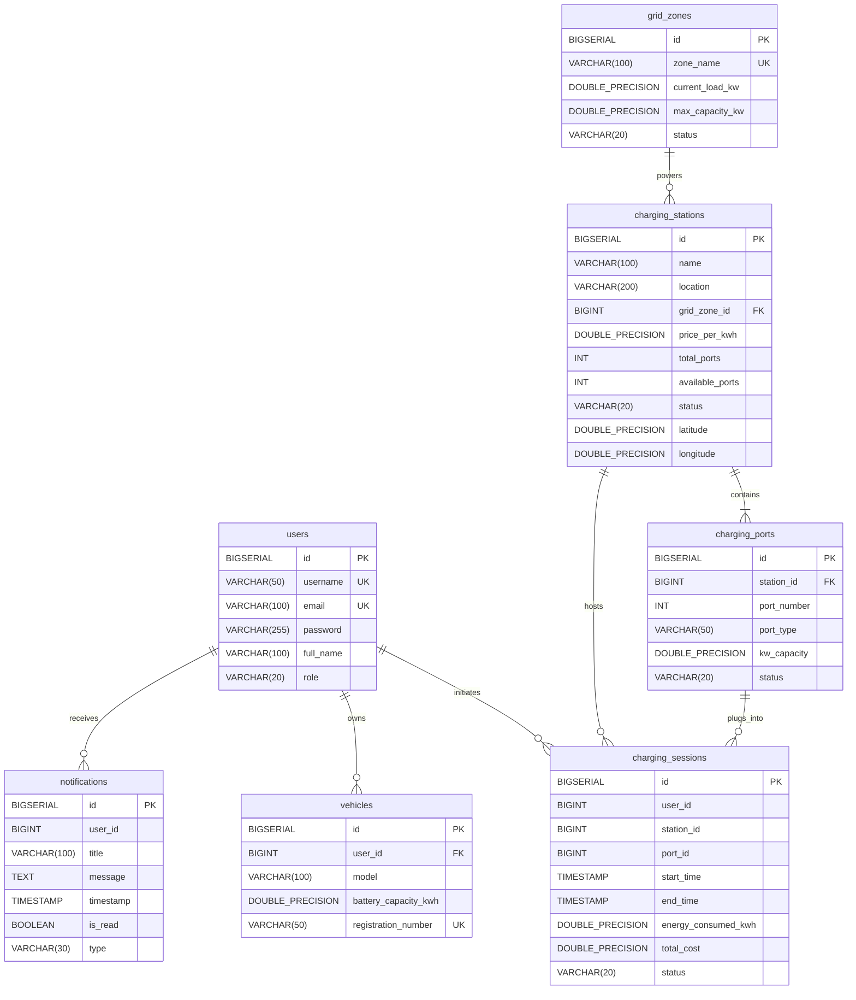

# PROJECT CONTEXT: Distributed EV Charging Station & Grid Load Balancing Platform

> **Primary Project Reference Document for AI Agents & Developers**  
> *Last Verified against Codebase: September 2026*  
> *Academic Context: PS046 — Service-Oriented Architecture (SOA)*

---

## 1. PROJECT OVERVIEW

* **Project Name:** Distributed EV Charging Station & Grid Load Balancing Platform (Brand/UI Name: **VoltGrid**)
* **Purpose:** A cloud-native Service-Oriented Architecture (SOA) platform designed to prevent urban power grid overloads caused by uncontrolled concurrent Electric Vehicle (EV) fast-charging. The platform models the Vijayawada municipal electrical grid across 5 zones and dynamically calculates grid load scores before allocating charging sessions. Stations situated in saturated grid zones exceeding a **90% load threshold** are automatically bypassed, intelligently rerouting vehicles to under-utilized stations with available ports.
* **Architecture Style:** Service-Oriented Architecture (SOA) / Microservices Orchestration.
* **Technology Stack:**
  * **Backend Framework:** Java 17 (LTS), Spring Boot `3.1.5`, Spring Cloud `2022.0.4`
  * **Service Discovery:** Netflix Eureka Server & Client (`spring-cloud-starter-netflix-eureka-client`)
  * **API Gateway:** Spring Cloud Gateway (Reactive / WebFlux) with custom Global Filters
  * **Resilience & Fault Tolerance:** Resilience4j Circuit Breakers, in-memory Token Bucket Rate Limiting (10 req/s)
  * **Security & Auth:** JJWT (`io.jsonwebtoken` `0.11.5`), BCrypt password hashing (`spring-security-crypto`), Gateway Bearer token validation
  * **Data Access & ORM:** Spring Data JPA with Hibernate (`hibernate.ddl-auto: update`)
  * **Database:** PostgreSQL 14+ (default: port 5432, database `ev_charging_db`, user `postgres`), H2 in-memory runtime driver dependency present
  * **Inter-Service Communication:** `@LoadBalanced RestTemplate` with Eureka `lb://` URI schemes
  * **Frontend:** React `18.2.0`, Vite `5.0.0`, React Router DOM `6.20.1`, Axios `1.6.2`, Lucide React `0.294.0`, Custom Vanilla CSS Glassmorphism Design System (`index.css`)
  * **Build System:** Apache Maven 3.9+, Node.js 18+ / npm

---

## 2. COMPLETE PROJECT STRUCTURE

```
d:\SOA PROJECT\
├── database/
│   ├── schema.sql                         # Complete PostgreSQL DDL schema (7 tables, foreign keys, constraints)
│   └── data.sql                           # Seed data: 5 Vijayawada grid zones, 5 EV stations, 24 ports, users, vehicles, sessions
├── service-registry/                      # Eureka Service Discovery Server (Port 8761)
│   ├── pom.xml
│   └── src/main/
│       ├── java/com/evcharging/serviceregistry/ServiceRegistryApplication.java
│       └── resources/application.yml
├── api-gateway/                           # Spring Cloud Gateway (Port 8080)
│   ├── pom.xml
│   └── src/main/
│       ├── java/com/evcharging/apigateway/
│       │   ├── ApiGatewayApplication.java # Gateway entry point
│       │   ├── JwtAuthenticationFilter.java# Order -1 GlobalFilter: validates JWT, passes X-User-* headers
│       │   ├── RateLimitFilter.java       # GlobalFilter: enforces 10 requests/sec per IP/user
│       │   ├── GatewayLoggingFilter.java  # Order 1 GlobalFilter: logs method, path, status, duration
│       │   └── FallbackController.java    # Circuit breaker fallback endpoints (503 response)
│       └── resources/application.yml      # Explicit routes, CORS configuration, Resilience4j CB settings
├── user-service/                          # User Auth & Profile Service (Port 8081)
│   ├── pom.xml
│   └── src/main/
│       ├── java/com/evcharging/userservice/
│       │   ├── UserServiceApplication.java# CommandLineRunner seeds default user/admin with BCrypt hash
│       │   ├── controller/UserController.java # Register, login, refresh, logout, profile, vehicle endpoints
│       │   ├── dto/                       # AuthResponse, LoginRequest, RegisterRequest
│       │   ├── entity/                    # User.java, Vehicle.java
│       │   ├── repository/                # UserRepository.java, VehicleRepository.java
│       │   └── util/JwtUtil.java          # Token generation (24h), refresh (7d), claims extraction, blacklist
│       └── resources/application.yml
├── station-service/                       # EV Station & Port Catalog (Port 8082)
│   ├── pom.xml
│   └── src/main/
│       ├── java/com/evcharging/stationservice/
│       │   ├── StationServiceApplication.java # Auto-seeds 5 Vijayawada stations & 24 ports
│       │   ├── controller/StationController.java # Station CRUD, port occupy/release, availability endpoints
│       │   ├── entity/                    # ChargingStation.java, ChargingPort.java
│       │   └── repository/                # ChargingStationRepository.java, ChargingPortRepository.java
│       └── resources/application.yml
├── charging-service/                      # Charging Session Lifecycle & Billing (Port 8083)
│   ├── pom.xml
│   └── src/main/
│       ├── java/com/evcharging/chargingservice/
│       │   ├── ChargingServiceApplication.java # Auto-seeds initial active & completed sessions
│       │   ├── controller/ChargingController.java # Start session, stop session, active session, history, stats
│       │   ├── entity/ChargingSession.java
│       │   └── repository/ChargingSessionRepository.java
│       └── resources/application.yml
├── grid-service/                          # Grid Zone Load Monitoring (Port 8084)
│   ├── pom.xml
│   └── src/main/
│       ├── java/com/evcharging/gridservice/
│       │   ├── GridServiceApplication.java# Auto-seeds 5 Vijayawada grid zones
│       │   ├── controller/GridController.java # Overall grid status, zone list, zone load update, add/remove load
│       │   ├── entity/GridZone.java       # Computes load % and NORMAL/HIGH_LOAD/OVERLOADED status
│       │   └── repository/GridZoneRepository.java
│       └── resources/application.yml
├── load-balancer-service/                 # Core SOA Orchestrator (Port 8085)
│   ├── pom.xml
│   └── src/main/
│       ├── java/com/evcharging/loadbalancerservice/
│       │   ├── LoadBalancerServiceApplication.java # @LoadBalanced RestTemplate configuration
│       │   ├── controller/LoadBalancerController.java # /select-station, /allocate, /recommendations
│       │   ├── dto/                       # AllocationResponse, ChargingRequest, StationCandidateDto
│       │   └── service/LoadBalancerService.java # Scoring algorithm, multi-service SOA coordination
│       └── resources/application.yml      # Eureka lb:// URLs for downstream services
├── notification-service/                  # User Notification Alert Dispatcher (Port 8086)
│   ├── pom.xml
│   └── src/main/
│       ├── java/com/evcharging/notificationservice/
│       │   ├── NotificationServiceApplication.java # Seeds sample notifications
│       │   ├── controller/NotificationController.java # Send, retrieve user notifications, mark read
│       │   ├── entity/Notification.java
│       │   └── repository/NotificationRepository.java
│       └── resources/application.yml
├── frontend/                              # React 18 Single Page Application (Port 3000)
│   ├── package.json
│   ├── vite.config.js                     # Dev server port 3000
│   ├── src/
│   │   ├── App.jsx                        # Routing, protected routes, auth state initialization
│   │   ├── main.jsx                       # React entry point
│   │   ├── index.css                      # Complete custom glassmorphism design system & styles
│   │   ├── components/
│   │   │   ├── Sidebar.jsx                # Collapsible navigation bar with role-aware badges
│   │   │   ├── TopBar.jsx                 # Top header with user profile badge & logout
│   │   │   └── Navbar.jsx                 # Alternative top navigation
│   │   ├── pages/
│   │   │   ├── LoginRegister.jsx          # Dual-mode authentication screen
│   │   │   ├── UserDashboard.jsx          # EV user overview with active session, quick actions
│   │   │   ├── FindStation.jsx            # Station catalog search, filtering, port inspection
│   │   │   ├── SmartCharging.jsx          # Interactive load balancer allocator with real-time scoring
│   │   │   ├── ChargingSessionPage.jsx    # Active charging live telemetry monitor & stop controls
│   │   │   ├── ChargingHistory.jsx        # Past charging sessions list & billing breakdown
│   │   │   ├── AdminDashboard.jsx         # Grid Simulator, Overload trigger, Station CRUD, metrics
│   │   │   └── SoaArchitecture.jsx        # Interactive SOA sequence & microservices architecture diagram
│   │   └── services/
│   │       └── api.js                     # Centralized Axios API client with Gateway + direct fallback
│   └── dist/                              # Production build output
├── run-all-backend-services.bat          # Windows batch script to launch all 8 backend services
├── run-frontend.bat                       # Windows batch script to launch the React frontend
├── start-all.bat                          # Complete orchestrator script: builds JARs, starts all 9 processes
├── start-all.ps1                          # PowerShell startup script with Eureka readiness health polling
├── stop-all.bat                           # Process terminator: frees ports 8761, 8080-8086, 3000 by PID
├── README.md                              # Academic overview & quick start guide
├── ARCHITECTURE.md                        # Detailed SOA architecture specification & sequence diagrams
└── REQUIREMENTS.md                        # Formal functional & non-functional requirements specification
```

---

## 3. ARCHITECTURE

### High-Level Architecture Pattern
The platform follows the **Service-Oriented Architecture (SOA)** and **Microservices** pattern:
1. **Single Entry Point:** The React frontend interacts only with the **API Gateway** (`http://localhost:8080`), which validates Bearer JWT tokens, handles CORS, enforces rate limits, logs requests, and forwards requests via dynamic Eureka discovery (`lb://<service-name>`).
2. **Dynamic Service Discovery:** Microservices self-register with **Netflix Eureka Server** (`service-registry` at port `8761`). Services renew registration every 30 seconds via heartbeats.
3. **SOA Orchestration:** The **Load Balancer Service** acts as an autonomous *SOA Orchestrator*. It holds **no persistent database** of its own. It composes calls across `station-service`, `grid-service`, `charging-service`, and `notification-service` to satisfy composite business goals.
4. **Database-per-Service Isolation:** Although sharing a physical PostgreSQL database instance (`ev_charging_db`), services maintain strict logical schema separation. Microservices never perform cross-database queries or touch tables owned by another service.

### Request & Data Flow

#### 1. Smart Station Allocation Flow (`POST /load-balancer/select-station`)
```
[React Frontend]
       │
       ▼ (HTTP POST with JWT)
[API Gateway :8080]
       │ (Validates JWT, injects X-User headers, routes via lb://load-balancer-service)
       ▼
[Load Balancer Orchestrator :8085]
       ├──> GET lb://station-service/stations
       │    └── Returns 5 stations with port availability
       ├──> GET lb://grid-service/grid/zones
       │    └── Returns 5 grid zones with current kW load and max capacity
       │
       ├─ [Scoring Algorithm Execution]
       │  Score = current_load_kw / max_capacity_kw
       │  Filter 1: Available Ports > 0
       │  Filter 2: Grid Zone Load < 90% (Not OVERLOADED)
       │  Sort: Ascending by load score
       │
       ▼
[Returns Ranked Recommendation + Alternative Stations]
```

#### 2. Charging Allocation Confirmation Flow (`POST /load-balancer/allocate`)
```
[User Confirms Station & Port on Frontend]
       │
       ▼
[Load Balancer Orchestrator :8085]
       │
       ├─ Step 1: POST lb://station-service/stations/{id}/ports/{portId}/occupy
       │          (Port marked OCCUPIED; availablePorts decremented; if 0, status -> FULL)
       │
       ├─ Step 2: POST lb://grid-service/grid/zones/{zoneId}/add-load  {"kw": 50.0}
       │          (Zone load increased by 50 kW; zone status re-evaluated)
       │
       ├─ Step 3: POST lb://charging-service/sessions/start
       │          (Session created with status ACTIVE, start_time, energy target, estimated cost)
       │
       ├─ Step 4: POST lb://notification-service/notifications/send
       │          (Session start notification stored for the user)
       │
       ▼
[Returns AllocationResponse with Session ID and Confirmation]
```

#### 3. Session Stop Flow
When a user stops an active session via the frontend:
1. `POST /sessions/stop` marks the session `COMPLETED` and records `end_time` in `charging-service`.
2. Frontend calls `POST /stations/{id}/ports/{portId}/release` to free the port on `station-service`.
3. Frontend calls `POST /grid/zones/{id}/remove-load` (`{"kw": 50.0}`) to deduct 50 kW from the grid zone on `grid-service`.

---

## 4. ALL SERVICES

### 1. Service Registry (`service-registry`)
* **Purpose:** Netflix Eureka Service Discovery Server. Maintains dynamic catalog of healthy microservice instances.
* **Port:** `8761`
* **Technology:** Spring Boot 3.1.5, `spring-cloud-starter-netflix-eureka-server`
* **Important Class:** `com.evcharging.serviceregistry.ServiceRegistryApplication` (`@EnableEurekaServer`)
* **Dependencies:** `spring-cloud-starter-netflix-eureka-server`, `spring-boot-starter-actuator`
* **APIs Exposed:**
  * Eureka Dashboard: `http://localhost:8761`
  * Eureka Client API: `GET/POST /eureka/apps`
  * Actuator Health: `GET /actuator/health`
* **Database Used:** None (In-memory registry)

### 2. API Gateway (`api-gateway`)
* **Purpose:** Centralized edge reverse proxy, routing all external frontend requests to microservices discovered via Eureka. Enforces JWT auth, rate limiting, circuit breaker fallbacks, and request logging.
* **Port:** `8080`
* **Technology:** Spring Boot 3.1.5, `spring-cloud-starter-gateway` (Reactive WebFlux), `spring-cloud-starter-circuitbreaker-reactor-resilience4j`
* **Important Classes:**
  * `JwtAuthenticationFilter`: Custom `GlobalFilter` (Order -1) extracting Bearer token, validating claims, and injecting `X-User-Name`, `X-User-Role`, `X-User-Id` headers. Whitelists `/users/login`, `/users/register`, `/users/refresh`, `/actuator/**`.
  * `RateLimitFilter`: Custom in-memory Token Bucket filter enforcing 10 requests/second per IP/user.
  * `GatewayLoggingFilter`: Custom `GlobalFilter` (Order 1) recording method, path, HTTP status, and response duration.
  * `FallbackController`: Handles Resilience4j circuit breaker redirects (`/fallback/{service}`), returning HTTP 503 JSON responses.
* **Dependencies:** Spring Cloud Gateway, Resilience4j, JJWT, Actuator, Eureka Client
* **APIs Exposed:** Proxies all microservices under `/users/**`, `/stations/**`, `/grid/**`, `/sessions/**`, `/load-balancer/**`, `/notifications/**`, plus fallback endpoints.
* **Database Used:** None

### 3. User Service (`user-service`)
* **Purpose:** Authentication, registration, JWT token generation, refresh token management, token blacklist (logout), user profiles, and EV vehicle registry.
* **Port:** `8081`
* **Technology:** Spring Boot 3.1.5, Spring Data JPA, `spring-security-crypto` (BCrypt), JJWT
* **Important Packages & Classes:**
  * `controller.UserController`: Handles `/users/**` endpoints.
  * `entity.User`, `entity.Vehicle`: JPA entities.
  * `repository.UserRepository`, `repository.VehicleRepository`: JPA repositories.
  * `util.JwtUtil`: Token issuance (HMAC-SHA256), verification, claim parsing, and in-memory blacklist (`ConcurrentHashMap`).
  * `UserServiceApplication`: `CommandLineRunner` seeds `user` and `admin` accounts with BCrypt-hashed passwords.
* **Dependencies:** Web, Data JPA, Actuator, Eureka Client, PostgreSQL, H2, JJWT, Spring Security Crypto, DevTools
* **APIs Exposed:**
  * `POST /users/register`: Register user/admin
  * `POST /users/login`: Authenticate and receive access + refresh tokens
  * `POST /users/refresh`: Issue new access token using refresh token
  * `POST /users/logout`: Blacklist access token
  * `GET /users/{id}`: Get user profile (password masked as `[PROTECTED]`)
  * `PUT /users/{id}`: Update user profile
  * `GET /users/{userId}/vehicles`: Get user vehicles
  * `POST /users/{userId}/vehicles`: Register a new vehicle
  * `GET /users/count`: Total user count
* **Database Used:** PostgreSQL / H2 (`users`, `vehicles` tables)

### 4. Station Service (`station-service`)
* **Purpose:** Manages the catalog of EV charging stations and individual charging ports, tracks port status, and executes port occupation/release.
* **Port:** `8082`
* **Technology:** Spring Boot 3.1.5, Spring Data JPA, Hibernate
* **Important Packages & Classes:**
  * `controller.StationController`: CRUD on stations, port occupy/release endpoints.
  * `entity.ChargingStation`: Station entity with eager `@OneToMany` relationship to `ChargingPort`.
  * `entity.ChargingPort`: Port entity (port number, connector type CCS2/Type 2/CHAdeMO, kW capacity, status).
  * `StationServiceApplication`: Auto-seeds 5 Vijayawada stations and 24 ports on clean startup.
* **Dependencies:** Web, Data JPA, Actuator, Eureka Client, PostgreSQL, H2
* **APIs Exposed:**
  * `GET /stations`: List all stations
  * `GET /stations/{id}`: Get station details
  * `POST /stations`: Create new station (auto-generates ports if omitted)
  * `PUT /stations/{id}`: Update station details
  * `DELETE /stations/{id}`: Delete station
  * `GET /stations/{id}/availability`: Get port availability breakdown
  * `POST /stations/{id}/ports/{portId}/occupy`: Mark port OCCUPIED
  * `POST /stations/{id}/ports/{portId}/release`: Mark port AVAILABLE
* **Database Used:** PostgreSQL / H2 (`charging_stations`, `charging_ports` tables)

### 5. Charging Session Service (`charging-service`)
* **Purpose:** Manages the full lifecycle of EV charging sessions, calculates energy usage and billing costs, and provides user session history and platform-wide statistics.
* **Port:** `8083`
* **Technology:** Spring Boot 3.1.5, Spring Data JPA
* **Important Packages & Classes:**
  * `controller.ChargingController`: Handles session start, stop, query, and statistics.
  * `entity.ChargingSession`: Session entity (`userId`, `stationId`, `portId`, `startTime`, `endTime`, `energyConsumedKwh`, `totalCost`, `status`).
  * `repository.ChargingSessionRepository`: Custom queries (`findByUserIdAndStatus`, `findFirstByUserIdAndStatusOrderByStartTimeDesc`, etc.).
  * `ChargingServiceApplication`: Auto-seeds initial active and completed sessions.
* **Dependencies:** Web, Data JPA, Actuator, Eureka Client, PostgreSQL, H2
* **APIs Exposed:**
  * `POST /sessions/start`: Start active session
  * `POST /sessions/stop`: Stop active session
  * `GET /sessions/{id}`: Get session by ID
  * `GET /sessions/user/{userId}`: User session history
  * `GET /sessions/user/{userId}/active`: User's current active session
  * `GET /sessions/active`: All currently active platform sessions
  * `GET /sessions/stats`: Total sessions, active count, energy sum, total revenue
* **Database Used:** PostgreSQL / H2 (`charging_sessions` table)

### 6. Grid Monitoring Service (`grid-service`)
* **Purpose:** Monitors regional electrical grid zones, tracks real-time load vs maximum capacity, determines zone health status, and allows admins to simulate load spikes or overloads.
* **Port:** `8084`
* **Technology:** Spring Boot 3.1.5, Spring Data JPA
* **Important Packages & Classes:**
  * `controller.GridController`: Grid status, zone retrieval, load update, add/remove load endpoints.
  * `entity.GridZone`: Zone entity. Contains `getLoadPercentage()` and `updateStatusBasedOnLoad()` logic:
    * `< 70%`: `NORMAL`
    * `70% - 89.9%`: `HIGH_LOAD`
    * `≥ 90%`: `OVERLOADED`
  * `repository.GridZoneRepository`: JPA repository.
  * `GridServiceApplication`: Seeds the 5 Vijayawada grid zones.
* **Dependencies:** Web, Data JPA, Actuator, Eureka Client, PostgreSQL, H2
* **APIs Exposed:**
  * `GET /grid/status`: Platform grid overview (average load %, total kW, overloaded count)
  * `GET /grid/zones`: List all 5 grid zones
  * `GET /grid/zones/{id}`: Get zone by ID
  * `GET /grid/zones/{id}/load`: Detailed load & overload status
  * `PUT /grid/zones/{id}/load`: Update zone load in kW (Admin simulation)
  * `POST /grid/zones/{id}/add-load`: Add kW load (`{"kw": 50.0}`)
  * `POST /grid/zones/{id}/remove-load`: Deduct kW load (`{"kw": 50.0}`)
* **Database Used:** PostgreSQL / H2 (`grid_zones` table)

### 7. Load Balancing Service (`load-balancer-service`)
* **Purpose:** Core SOA Orchestrator. Evaluates charging candidates across `station-service` and `grid-service`, applies the grid load balancing algorithm, and coordinates 4-step allocation transactions across microservices using `@LoadBalanced RestTemplate`.
* **Port:** `8085`
* **Technology:** Spring Boot 3.1.5, Spring Cloud LoadBalancer
* **Important Packages & Classes:**
  * `LoadBalancerServiceApplication`: Declares `@LoadBalanced RestTemplate` bean.
  * `service.LoadBalancerService`: Orchestrates calls to `lb://station-service`, `lb://grid-service`, `lb://charging-service`, and `lb://notification-service`.
  * `controller.LoadBalancerController`: Exposes selection, allocation, and recommendation endpoints.
  * `dto.StationCandidateDto`, `dto.AllocationResponse`, `dto.ChargingRequest`: Data transfer objects.
* **Dependencies:** Web, Actuator, Eureka Client, Spring Cloud LoadBalancer
* **APIs Exposed:**
  * `POST /load-balancer/select-station`: Calculate load scores and rank eligible stations
  * `POST /load-balancer/allocate`: Execute 4-step orchestration transaction
  * `GET /load-balancer/recommendations`: Quick recommendation query
* **Database Used:** **None (Stateless Orchestrator)**

### 8. Notification Service (`notification-service`)
* **Purpose:** Stores and serves user in-app notification alerts dispatched by the Load Balancer Orchestrator or system events.
* **Port:** `8086`
* **Technology:** Spring Boot 3.1.5, Spring Data JPA
* **Important Packages & Classes:**
  * `controller.NotificationController`: Send, fetch, and mark notifications as read.
  * `entity.Notification`: Entity (`userId`, `title`, `message`, `timestamp`, `isRead`, `type`).
  * `repository.NotificationRepository`: Queries by `userId` ordered by timestamp descending.
  * `NotificationServiceApplication`: Seeds initial demo notifications.
* **Dependencies:** Web, Data JPA, Actuator, Eureka Client, PostgreSQL, H2
* **APIs Exposed:**
  * `POST /notifications/send`: Persist notification alert
  * `GET /notifications/user/{userId}`: List notifications for user
  * `GET /notifications/all`: List all notifications
  * `PUT /notifications/{id}/read`: Mark notification as read
* **Database Used:** PostgreSQL / H2 (`notifications` table)

---

## 5. API DOCUMENTATION

### Authentication & Users (`user-service` via Gateway `:8080`)

| Method | Endpoint | Purpose | Request Body | Response Body | Auth Required |
|---|---|---|---|---|---|
| `POST` | `/users/register` | Register new user | `{"username":"alice", "email":"a@b.com", "password":"password123", "fullName":"Alice", "role":"ROLE_USER"}` | `AuthResponse` with `token`, `refreshToken`, user details (HTTP 201) | Public |
| `POST` | `/users/login` | Authenticate user | `{"username":"user", "password":"password123"}` | `AuthResponse` with `token`, `refreshToken`, user details (HTTP 200) | Public |
| `POST` | `/users/refresh` | Issue new access token | `{"refreshToken":"<jwt-refresh-token>"}` | `{"token":"...", "expiresIn":86400, "username":"...", "role":"..."}` | Public |
| `POST` | `/users/logout` | Blacklist active token | None (Reads `Authorization: Bearer <token>`) | `{"message":"Successfully logged out..."}` | Bearer Token |
| `GET` | `/users/{id}` | Get user profile | None | User object (`password` masked as `[PROTECTED]`) | Bearer Token |
| `PUT` | `/users/{id}` | Update profile | `{"fullName":"Ravi K.", "email":"ravi@new.com"}` | Updated user object | Bearer Token |
| `GET` | `/users/{userId}/vehicles` | List user vehicles | None | Array of `Vehicle` objects | Bearer Token |
| `POST` | `/users/{userId}/vehicles` | Add vehicle | `{"model":"Tata Nexon EV", "batteryCapacityKwh":40.5, "registrationNumber":"AP16 EV 9999"}` | Saved `Vehicle` object (HTTP 201) | Bearer Token |
| `GET` | `/users/count` | Total user count | None | Number (e.g. `2`) | Bearer Token |

### Stations & Ports (`station-service` via Gateway `:8080`)

| Method | Endpoint | Purpose | Request Body | Response Body | Auth Required |
|---|---|---|---|---|---|
| `GET` | `/stations` | List all EV stations | None | Array of `ChargingStation` objects with nested `ports` | Bearer Token |
| `GET` | `/stations/{id}` | Station detail | None | `ChargingStation` object | Bearer Token |
| `POST` | `/stations` | Create station | `{"name":"Station A", "location":"MG Road", "gridZoneId":1, "pricePerKwh":12.5, "totalPorts":4}` | Saved `ChargingStation` object (HTTP 201) | Admin (`ROLE_ADMIN`) |
| `PUT` | `/stations/{id}` | Update station | `{"name":"Updated Name", "pricePerKwh":13.0}` | Updated `ChargingStation` object | Admin (`ROLE_ADMIN`) |
| `DELETE` | `/stations/{id}` | Delete station | None | `"Station deleted successfully"` | Admin (`ROLE_ADMIN`) |
| `GET` | `/stations/{id}/availability` | Port availability | None | `{"stationId":1, "availablePorts":4, "ports":[...]}` | Bearer Token |
| `POST` | `/stations/{id}/ports/{portId}/occupy` | Mark port occupied | None | `{"message":"Port occupied successfully", "availablePorts":3}` | Internal / Bearer |
| `POST` | `/stations/{id}/ports/{portId}/release` | Free port | None | `{"message":"Port released successfully", "availablePorts":4}` | Internal / Bearer |

### Grid Monitoring (`grid-service` via Gateway `:8080`)

| Method | Endpoint | Purpose | Request Body | Response Body | Auth Required |
|---|---|---|---|---|---|
| `GET` | `/grid/status` | System grid summary | None | `{"totalZones":5, "totalCurrentLoadKw":1145.0, "averageGridLoadPercentage":45.8, "overloadedZonesCount":0, "systemStatus":"STABLE"}` | Bearer Token |
| `GET` | `/grid/zones` | List all 5 grid zones | None | Array of `GridZone` objects (`id`, `zoneName`, `currentLoadKw`, `maxCapacityKw`, `status`) | Bearer Token |
| `GET` | `/grid/zones/{id}` | Single zone info | None | `GridZone` object | Bearer Token |
| `GET` | `/grid/zones/{id}/load` | Detailed zone load | None | `{"zoneId":1, "currentLoadKw":210.0, "loadPercentage":42.0, "isOverloaded":false, ...}` | Bearer Token |
| `PUT` | `/grid/zones/{id}/load` | Update load (simulate) | `{"currentLoadKw": 470.0}` | Updated `GridZone` object | Admin (`ROLE_ADMIN`) |
| `POST` | `/grid/zones/{id}/add-load` | Add session load | `{"kw": 50.0}` | Updated `GridZone` object | Internal / Bearer |
| `POST` | `/grid/zones/{id}/remove-load` | Remove session load | `{"kw": 50.0}` | Updated `GridZone` object | Internal / Bearer |

### Load Balancing & Orchestration (`load-balancer-service` via Gateway `:8080`)

| Method | Endpoint | Purpose | Request Body | Response Body | Auth Required |
|---|---|---|---|---|---|
| `POST` | `/load-balancer/select-station` | Calculate load scores & rank stations | `{"userId": 1, "requiredEnergyKwh": 25.0}` | `AllocationResponse`: `recommendedStation` (lowest grid score), `alternativeStations`, `status` (`SUCCESS` or `WARNING_OVERLOAD`) | Bearer Token |
| `POST` | `/load-balancer/allocate` | 4-step SOA composite transaction | `{"userId": 1, "stationId": 5, "portId": 21, "requiredEnergyKwh": 25.0}` | `{"status":"SUCCESS", "message":"...", "sessionId":3, "estimatedCost":262.5}` | Bearer Token |
| `GET` | `/load-balancer/recommendations` | Quick recommendation | None (`?userId=1&energyKwh=25.0`) | `AllocationResponse` | Bearer Token |

### Charging Sessions (`charging-service` via Gateway `:8080`)

| Method | Endpoint | Purpose | Request Body | Response Body | Auth Required |
|---|---|---|---|---|---|
| `POST` | `/sessions/start` | Start session | `{"userId":1, "stationId":1, "portId":1, "energyConsumedKwh":25.0, "pricePerKwh":14.5}` | `ChargingSession` object (`id`, `status":"ACTIVE"`) | Internal / Bearer |
| `POST` | `/sessions/stop` | Stop session | `{"sessionId": 1}` or `{"userId": 1}` | Updated `ChargingSession` (`status":"COMPLETED"`, `endTime`) | Bearer Token |
| `GET` | `/sessions/{id}` | Session details | None | `ChargingSession` object | Bearer Token |
| `GET` | `/sessions/user/{userId}` | User session history | None | Array of `ChargingSession` objects | Bearer Token |
| `GET` | `/sessions/user/{userId}/active` | Current active session | None | Active `ChargingSession` or `null` | Bearer Token |
| `GET` | `/sessions/active` | All active sessions | None | Array of active `ChargingSession` objects | Bearer Token |
| `GET` | `/sessions/stats` | Platform statistics | None | `{"totalSessions":2, "activeSessions":1, "totalEnergyConsumedKwh":42.5, "totalRevenue":532.25}` | Bearer Token |

### Notifications (`notification-service` via Gateway `:8080`)

| Method | Endpoint | Purpose | Request Body | Response Body | Auth Required |
|---|---|---|---|---|---|
| `POST` | `/notifications/send` | Dispatch alert | `{"userId":1, "title":"...", "message":"...", "type":"SESSION_START"}` | Saved `Notification` object | Internal / Bearer |
| `GET` | `/notifications/user/{userId}`| User notification list | None | Array of `Notification` objects (newest first) | Bearer Token |
| `PUT` | `/notifications/{id}/read` | Mark read | None | Updated `Notification` (`isRead": true`) | Bearer Token |

---

## 6. DATABASE

* **Database Engine:** PostgreSQL 14+ (Local port 5432) / H2 in-memory runtime driver.
* **Database Name:** `ev_charging_db`
* **Default Credentials:** Username: `postgres`, Password: `password123` (or `123456` in batch scripts).

### Tables, Fields, and Relationships



### Pre-Seeded Domain Entities (Vijayawada Region)
1. **Grid Zones (5 Zones, 500 kW capacity each):**
   * Zone 1: *Vijayawada Central* (210 kW load, NORMAL)
   * Zone 2: *Benz Circle Hub* (320 kW load, HIGH_LOAD)
   * Zone 3: *Gollapudi West* (180 kW load, NORMAL)
   * Zone 4: *Auto Nagar Industrial* (260 kW load, NORMAL)
   * Zone 5: *Mangalagiri South* (175 kW load, NORMAL)
2. **Charging Stations (5 Stations):**
   * Station 1: *Vijayawada Central EV Station* (Zone 1, ₹14.50/kWh, 6 ports)
   * Station 2: *Benz Circle EV Charging Hub* (Zone 2, ₹16.00/kWh, 6 ports)
   * Station 3: *Gollapudi EV Power Station* (Zone 3, ₹11.50/kWh, 4 ports)
   * Station 4: *Auto Nagar EV Fast Station* (Zone 4, ₹13.00/kWh, 4 ports)
   * Station 5: *Mangalagiri EV Station* (Zone 5, ₹10.50/kWh, 4 ports)

---

## 7. AUTHENTICATION & SECURITY

1. **Password Hashing:**
   * Handled by Spring Security's `BCryptPasswordEncoder(10)`.
   * Raw passwords are never stored in the database.
   * `GET /users/{id}` sanitizes output by setting `password = "[PROTECTED]"`.
2. **Token Architecture:**
   * **Access Token:** HMAC-SHA256 signature using `JWT_SECRET` (default 52-char secret). Expiration: 24 hours (86,400,000 ms). Claims: `sub` (username), `userId`, `role`.
   * **Refresh Token:** Expiration: 7 days (604,800,000 ms). Claims: `sub`, `userId`, `type: "REFRESH"`.
3. **Gateway Verification (`JwtAuthenticationFilter`):**
   * Runs as a Reactive `GlobalFilter` at Order `-1`.
   * Whitelisted routes bypass auth: `/users/login`, `/users/register`, `/users/refresh`, `/actuator/**`.
   * Protected routes must include header `Authorization: Bearer <token>`.
   * Mutates incoming request before downstream routing with injected headers:
     * `X-User-Name`: authenticated username
     * `X-User-Role`: user role (`ROLE_USER` or `ROLE_ADMIN`)
     * `X-User-Id`: user database ID
4. **Token Invalidation & Blacklist:**
   * `POST /users/logout` stores the access token string in `JwtUtil`'s `ConcurrentHashMap<String, Long> blacklist`.
5. **Role-Based Access Control (RBAC):**
   * `ROLE_USER`: Can access user dashboard, smart allocation, active session controls, charging history.
   * `ROLE_ADMIN`: Can access admin center, trigger grid overload simulations, add/edit/delete stations, view system-wide stats.
6. **Pre-Seeded Credentials:**
   * User: `user` / `password123` (`ROLE_USER`)
   * Admin: `admin` / `password123` (`ROLE_ADMIN`)

---

## 8. FRONTEND

* **Framework & Build:** React 18 SPA bundled with Vite 5.
* **Navigation & Layout:**
  * Root wrapper in `App.jsx` checks `localStorage.getItem('ev_user')`.
  * If unauthenticated, displays fullscreen `LoginRegister.jsx` (`/login`).
  * If authenticated, renders `app-shell` containing `Sidebar.jsx`, `TopBar.jsx`, and dynamic page content.
* **Pages:**
  * `LoginRegister.jsx` (`/login`): Toggle between login and registration tabs.
  * `UserDashboard.jsx` (`/dashboard`): Status badges, quick navigation cards, active session preview.
  * `FindStation.jsx` (`/stations`): Live catalog, filter by zone or connector type, port status modals.
  * `SmartCharging.jsx` (`/smart-charging`): Interactive grid allocator. Sliders for energy required (kWh). Evaluates grid load scores, highlights recommended station with lowest score, warns if overload detected, confirms reservation.
  * `ChargingSessionPage.jsx` (`/active-session`): Real-time charging dashboard with kWh counter, elapsed timer, simulated battery progress bar, and "Stop Session" trigger.
  * `ChargingHistory.jsx` (`/history`): Tabular history of previous sessions with station names, energy consumed, and total charges.
  * `AdminDashboard.jsx` (`/` and `/admin`):
    * High-level grid metrics cards (average load %, total kW load, overloaded zones).
    * **Interactive Grid Zone Simulator:** Sliders to alter zone loads, "Trigger Overload (>90%)" buttons to simulate grid emergency, "Reset Load" buttons.
    * Station Management CRUD (Add Station modal, edit price, delete station).
  * `SoaArchitecture.jsx`: Interactive visual breakdown of microservices, Eureka registration, and allocation sequence.
* **API Client (`src/services/api.js`):**
  * Dispatches requests to API Gateway (`http://localhost:8080`).
  * Implements fallback mapping to direct microservice ports (`:8081` to `:8086`) in case Gateway is offline during independent debugging.

---

## 9. HOW TO RUN

### Prerequisites
1. **Java JDK 17+** (Ensure `java -version` works).
2. **Node.js 18+ & npm** (Ensure `node -v` works).
3. **PostgreSQL 14+** running on port 5432 (Database `ev_charging_db`). *Optional: If PostgreSQL is offline, services can run with H2 fallback.*

### Method A: Automated Launcher (Recommended for Windows)

From the project root `d:\SOA PROJECT\`:
```cmd
start-all.bat
```
*Or via PowerShell:*
```powershell
.\start-all.ps1
```
* **What this does:**
  1. Checks JDK 17 and environment variables.
  2. Launches **1. Service Registry [8761]** and polls `http://localhost:8761/actuator/health` until UP.
  3. Sequentially launches **2. API Gateway [8080]**, **3. User Service [8081]**, **4. Station Service [8082]**, **5. Charging Service [8083]**, **6. Grid Service [8084]**, **7. Load Balancer [8085]**, and **8. Notification Service [8086]**.
  4. Launches **9. React Frontend [3000]** (`npm run dev`).
  5. Opens separate labeled command windows for each service.

### Method B: Manual Step-by-Step Launch Order

If launching services individually, **always adhere to this strict startup order**:

```bash
# 1. Service Registry (MUST START FIRST)
cd service-registry
mvn spring-boot:run
# Wait ~15 seconds until Eureka is up at http://localhost:8761

# 2. API Gateway
cd api-gateway
mvn spring-boot:run

# 3. User Service
cd user-service
mvn spring-boot:run

# 4. Station Service
cd station-service
mvn spring-boot:run

# 5. Charging Session Service
cd charging-service
mvn spring-boot:run

# 6. Grid Monitoring Service
cd grid-service
mvn spring-boot:run

# 7. Load Balancer Service (SOA Orchestrator)
cd load-balancer-service
mvn spring-boot:run

# 8. Notification Service
cd notification-service
mvn spring-boot:run

# 9. React Frontend
cd frontend
npm install
npm run dev
```

### How to Stop Everything
Run the teardown script to kill processes across all allocated ports:
```cmd
stop-all.bat
```

---

## 10. HOW TO VERIFY

### 1. Health-Check URLs
All microservices expose standard Spring Boot Actuator health endpoints:

| Service | Port | Health URL | Expected Status |
|---|---|---|---|
| Service Registry | 8761 | `http://localhost:8761/actuator/health` | `{"status":"UP"}` |
| API Gateway | 8080 | `http://localhost:8080/actuator/health` | `{"status":"UP"}` |
| User Service | 8081 | `http://localhost:8081/actuator/health` | `{"status":"UP"}` |
| Station Service | 8082 | `http://localhost:8082/actuator/health` | `{"status":"UP"}` |
| Charging Service | 8083 | `http://localhost:8083/actuator/health` | `{"status":"UP"}` |
| Grid Service | 8084 | `http://localhost:8084/actuator/health` | `{"status":"UP"}` |
| Load Balancer | 8085 | `http://localhost:8085/actuator/health` | `{"status":"UP"}` |
| Notification Service | 8086 | `http://localhost:8086/actuator/health` | `{"status":"UP"}` |

### 2. Eureka Service Registration Verification
Open the Eureka Dashboard in a browser:
* URL: `http://localhost:8761`
* **Verification Criteria:** Under **"Instances currently registered with Eureka"**, ensure all 7 client application IDs appear:
  * `API-GATEWAY`
  * `USER-SERVICE`
  * `STATION-SERVICE`
  * `CHARGING-SERVICE`
  * `GRID-SERVICE`
  * `LOAD-BALANCER-SERVICE`
  * `NOTIFICATION-SERVICE`

### 3. Verification Test Scenario: Smart Allocation with Overload Bypass
1. Open `http://localhost:3000` and log in as `admin` / `password123`.
2. Navigate to **Admin Center** -> **Grid Simulator**.
3. Under **Zone 1 - Vijayawada Central**, click **Trigger Overload (>90%)**. Observe zone load jump to 470 kW (94%) with status badge changing to `OVERLOADED`.
4. Switch to **Smart Charging** page (or log in as `user` / `password123`).
5. Request allocation for `25 kWh`.
6. **Expected Response:** Station 1 (Vijayawada Central) is flagged as overloaded and bypassed. Station 5 (Mangalagiri EV Station) or Station 3 (Gollapudi) is selected as the recommended station with the lowest load score (`~0.35`).
7. Click **Confirm Charging**.
8. **Expected Verification:**
   * A port on Station 5 is marked `OCCUPIED`.
   * Grid Zone 5 load increases by +50 kW.
   * An active session is created in `charging-service`.
   * A notification is dispatched and visible in the top notification tray.
   * User is redirected to `/active-session` displaying live charging telemetry.

---

## 11. CURRENT IMPLEMENTATION STATUS

* [x] **Service Discovery:** Eureka server configured and all 7 client services registering with health heartbeats.
* [x] **API Gateway:** Reactive Gateway routing paths with Circuit Breakers, Rate Limiter (10 req/s), Request Logging, and JWT Bearer validation.
* [x] **User Management & Security:** BCrypt password hashing, JWT access + refresh tokens, logout blacklist, default vehicle auto-assignment.
* [x] **Station Management:** Catalog of 5 stations, 24 ports, port availability tracking, automatic port generation on station creation.
* [x] **Grid Monitoring:** Real-time zone load tracking across 5 Vijayawada zones with automatic status calculation (`NORMAL`, `HIGH_LOAD`, `OVERLOADED`).
* [x] **SOA Orchestration:** Load Balancer composing 4 downstream microservices via Eureka `lb://` URIs with fallback on full grid saturation.
* [x] **Charging Lifecycle:** Session initiation, active telemetry simulation, session stopping, and billing calculations.
* [x] **Notifications:** Alert persistence and retrieval.
* [x] **Frontend UI:** Dark-mode glassmorphism interface, responsive sidebar, Grid simulator with one-click overload trigger, station finder, active session tracker, history table, and SOA architecture visualizer.
* [x] **Automation Scripts:** `start-all.bat`, `start-all.ps1`, `stop-all.bat`.

---

## 12. KNOWN ISSUES & LIMITATIONS

1. **In-Memory Token Blacklist:** The JWT blacklist in `user-service` (`JwtUtil`) uses an in-memory `ConcurrentHashMap`. Restarting `user-service` clears the blacklist. Furthermore, the API Gateway validates JWT signatures locally without making an RPC call to `user-service` for blacklist checking (designed to minimize gateway latency).
2. **Manual Grid Load Decrement:** While `load-balancer-service` automatically calls `/grid/zones/{id}/add-load` (+50 kW) on session creation, releasing the load on session completion currently requires the caller/frontend to invoke `/grid/zones/{id}/remove-load` or simulate via Admin Simulator.
3. **Direct Port Fallback in Frontend:** In `frontend/src/services/api.js`, requests attempt the API Gateway first (`:8080`), with a fallback to direct microservice ports (`:8081` to `:8086`) if the gateway times out. Direct calls bypass gateway rate limiting and gateway JWT inspection.
4. **H2 Fallback Profile:** Maven pom.xml files include the H2 database dependency, but `application.yml` files are pre-configured for PostgreSQL (`jdbc:postgresql://localhost:5432/ev_charging_db`). If PostgreSQL is not installed or running, environment variables `SPRING_DATASOURCE_URL`, `SPRING_DATASOURCE_DRIVER`, `SPRING_DATASOURCE_USERNAME`, and `SPRING_DATASOURCE_PASSWORD` must be set to H2 in-memory parameters.
5. **Simulated Hardware:** The platform is a software simulation; physical OCPP / MQTT charger telemetry streams are out of scope.

---

## 13. IMPORTANT DEVELOPMENT RULES

* **Do not unnecessarily rewrite working code:** Microservices have clean, verified boundaries. Make surgical changes only.
* **Preserve existing APIs:** Microservices depend on fixed contracts (`/stations`, `/grid/zones`, `/sessions/start`, `/notifications/send`, etc.). Never change endpoint paths or request/response payloads unless explicitly instructed.
* **Preserve SOA Loose Coupling:** Microservices must NEVER access or share another microservice's database tables. All cross-domain collaboration MUST occur via REST APIs through Eureka `lb://` or API Gateway.
* **Use `@LoadBalanced RestTemplate`:** Inter-service calls inside orchestrator services must use Eureka service names (e.g. `lb://station-service/stations`) rather than hardcoded `http://localhost:8082`.
* **Inspect only relevant files:** Before changing code, inspect only the files relevant to the requested change.
* **Do not scan the entire repository:** `PROJECT_CONTEXT.md` contains the complete architectural and structural context. Refer to this document rather than performing exhaustive repository scans.

---

## 14. RECENT CHANGES

### September 2026 — Initial Setup
* Created `PROJECT_CONTEXT.md` as the persistent single source of truth for all future AI agents and developers.
* Audited and verified all 8 microservice configurations, database schemas, Eureka registration, API gateway filters, and React frontend routing against the active codebase.

### September 2026 — Dashboard Conversion (Static → Fully Dynamic)

**Goal:** Convert the entire dashboard UI from static/hardcoded data to a fully functional dynamic application backed by real microservice APIs.

#### Action 1 — Backend: Added `GET /sessions` endpoint
* **File:** `charging-service/src/main/java/com/evcharging/chargingservice/controller/ChargingController.java`
* **Change:** Added `@GetMapping` method `getAllSessions()` at the class root path `/sessions` that returns `sessionRepository.findAll()`.
* **Purpose:** Admin dashboard needs all sessions (not just active ones) to compute the 7-day energy and revenue bar/line charts.
* **Status:** ✅ VERIFIED — file confirmed at lines 98–101.

#### Action 2 — Frontend API Layer: Added new methods to `api.js`
* **File:** `frontend/src/services/api.js`
* **Changes:**
  * Added `getAllSessions: () => apiCall('get', '/sessions', null, 'charging')` to `chargingService`.
  * Added `getAllNotifications: () => apiCall('get', '/notifications/all', null, 'notification')` to `notificationService`.
* **Status:** ✅ VERIFIED — both methods present in file.

#### Action 3 — Frontend: Full rewrite of `AdminDashboard.jsx`
* **File:** `frontend/src/pages/AdminDashboard.jsx`
* **All static items removed and replaced:**
  * ❌ Removed `ENERGY_DATA` constant (7 hardcoded kWh values).
  * ❌ Removed `REVENUE_DATA` constant (7 hardcoded revenue values).
  * ❌ Removed `ACTIVITY_FEED` constant (5 fake activity items with fake session IDs/users/stations).
  * ❌ Removed KPI fallbacks: `|| 142`, `|| 36`, `|| 1284`, `|| 56230`, `|| 68` (all showed dramatically wrong numbers).
  * ❌ Removed hardcoded `offlinePorts = 10` — now computed from real station data.
  * ❌ Removed fake session table rows (`S. Kumar`, `P. Reddy`, `Tesla Model 3` etc.) — now shows real ACTIVE sessions or proper empty state.
  * ❌ Removed hardcoded trend badges (`↑ 12%`, `↑ 20%`, `↑ 18%`, `↑ 22%`) — replaced with real contextual subtitles.
  * ❌ Fixed "Start New Session" Quick Action — was pointing to Add Station modal; now navigates to `/smart-charging`.
  * ❌ Fixed "View All" dead `<span>` links — now real `<Link to="/history">` and `<Link to="/stations">` elements.
* **New dynamic behavior:**
  * ✅ Fetches 7 datasets in parallel on mount: stations, grid zones, grid status, charging stats, user count, active sessions, ALL sessions.
  * ✅ `computeDailyData()` helper groups all sessions by `startTime` date and aggregates `energyConsumedKwh` and `totalCost` per day for last 7 days — powers the energy bar chart and revenue line chart with real data.
  * ✅ `activityFeed` is derived from real active sessions — shows station name, port number, and computed time ago.
  * ✅ KPI cards now show: `stations.length`, `chargingStats.activeSessions`, `chargingStats.totalEnergyConsumedKwh`, `chargingStats.totalRevenue` — all `0` or `—` when loading (no fake fallbacks).
  * ✅ `offlinePorts = Math.max(0, totalPortCount - inUsePorts - availPorts)` — computed from real data.
  * ✅ Grid status label is dynamically `Stable` / `High Load` / `Overloaded` based on real `averageGridLoadPercentage`.
  * ✅ Auto-refresh every 10 seconds (reduced from 5s to reduce API pressure).
  * ✅ DonutChart renders correctly with real port utilization data (no more hardcoded `|| 72` port counts).
* **Status:** ✅ VERIFIED — file saved at 767 lines, 34,367 bytes.

#### Action 4 — Frontend: Enhanced `UserDashboard.jsx`
* **File:** `frontend/src/pages/UserDashboard.jsx`
* **Changes:**
  * ✅ Added **error state banner** — displays a red alert with the error message and a "Retry" button when any API call fails; silently ignored before.
  * ✅ Added **mark-as-read on notification click** — clicking an unread notification calls `notificationService.markAsRead(n.id)` and optimistically updates state; shows spinner while pending.
  * ✅ Added **unread notification count badge** — red pill badge next to the section title showing unread count.
  * ✅ Added **"NEW" tag** on unread notifications for visual prominence.
  * ✅ Added **"View Live Telemetry →" link** inside active session card (links to `/active-session`).
  * ✅ Added **third feature card** for Charging History (previously only had 2 cards).
  * ✅ Real tariff price `₹{sessionStation.pricePerKwh}/kWh` from actual station object instead of hardcoded `₹14.50/kWh`.
  * ✅ Loading spinner icon (`RefreshCw spin`) shown during data load instead of plain text.
  * ✅ Poll interval changed to 10 seconds (from 5s).
#### Action 5 — Build & Startup Resolution: Packaged All 8 Executable Spring Boot JARs
* **Root Cause Diagnosed:** `start-all.bat` hung at `[INFO] Waiting for Eureka to be ready at http://localhost:8761 ...`. Investigation revealed that the `target/` directories contained thin classes-only JARs (3KB - 19KB) without the Spring Boot executable repackaging. Executing `java -jar target/*.jar` caused `no main manifest attribute`, resulting in immediate failure of the background CMD windows.
* **Action Taken:**
  * Clean packaged all 8 microservices with `mvn package -DskipTests` using the Maven installation (`C:\Users\Harsha\.m2\wrapper\dists\apache-maven-3.9.16\...`).
  * Compiled the newly added `GET /sessions` endpoint in `charging-service` with zero compile errors.
  * Generated executable Spring Boot fat JARs for all 8 microservices:
    * `service-registry-1.0.0.jar` (59 MB)
    * `api-gateway-1.0.0.jar` (55 MB)
    * `user-service-1.0.0.jar` (78 MB)
    * `station-service-1.0.0.jar` (78 MB)
    * `charging-service-1.0.0.jar` (78 MB)
    * `grid-service-1.0.0.jar` (78 MB)
    * `load-balancer-service-1.0.0.jar` (51 MB)
    * `notification-service-1.0.0.jar` (78 MB)
* **Endpoint Verification:**
  * Tested direct `/sessions` endpoint on `charging-service` (port 8083) — returned all historical session records with energy and revenue.
  * Verified Eureka registration for all 7 microservices (`API-GATEWAY`, `USER-SERVICE`, `STATION-SERVICE`, `CHARGING-SERVICE`, `GRID-SERVICE`, `LOAD-BALANCER-SERVICE`, `NOTIFICATION-SERVICE`).
  * Verified API Gateway Bearer JWT authentication and routing to all services: `/stations`, `/grid/zones`, `/sessions`, `/sessions/active`, `/sessions/stats`, `/users/count`, `/notifications/all` all respond with 200 OK.
* **Status:** ✅ VERIFIED — All 8 JARs built, executable, and validated.

#### Action 6 — Frontend: Interactive Dropdowns & Complete Navigation Architecture
* **Root Cause Diagnosed:**
  1. The TopBar notification bell (`<button className="topbar-notif-btn">`) and user profile card (`<div className="topbar-user">`) were static with no click handlers or dropdown popovers.
  2. In `Sidebar.jsx`, the navigation items `Users`, `Analytics`, `Grid Load`, `Notifications`, `Profile`, and `Settings` were all hardcoded to `to='/stations'`. Clicking any of them just kept redirecting to Charging Stations.
* **Actions Taken:**
  * **TopBar Dropdown Implementation (`TopBar.jsx`):**
    * Added interactive notification bell dropdown with real-time unread badge count, live alerts fetched from Notification Service (`/notifications/all`), mark-as-read per item, mark all read, and direct link to notifications inbox.
    * Added interactive user profile dropdown with avatar, full name, username, role badge (`ADMIN`/`EV DRIVER`), links to Profile, Settings, SOA Architecture, and working Sign Out.
    * Added dropdown CSS styles in `index.css` with smooth fade-in animations and responsive positioning.
  * **Sidebar Navigation Fix (`Sidebar.jsx`):**
    * Replaced all duplicate `/stations` links with dedicated routes:
      * `Users` → `/users`
      * `Analytics` → `/analytics`
      * `Grid Load` → `/grid-load`
      * `Notifications` → `/notifications`
      * `SOA Architecture` → `/soa-architecture`
      * `Profile` → `/profile`
      * `Settings` → `/settings`
  * **New Dedicated Pages Created & Connected (`frontend/src/pages/`):**
    * `Users.jsx`: System user accounts, role inspector, registered EV vehicle fleet table, and vehicle registration modal.
    * `Analytics.jsx`: 7-Day energy delivery bar chart, 7-day revenue collection trend, port utilization, and session telemetry ledger.
    * `GridLoad.jsx`: Real-time monitor of the 5 Vijayawada Grid Zones, load gauges, automatic SOA >90% overload bypass policy indicator, and interactive load injection/relief controls (`+50 kW` / `-50 kW` / `Reset`).
    * `NotificationsPage.jsx`: Full notification inbox with filter tabs (All, Unread, Alerts), real-time polling, and mark-as-read.
    * `Profile.jsx`: User identity card, registered EVs list, and "Add Vehicle" modal.
    * `Settings.jsx`: Live connectivity health check for API Gateway (:8080), Eureka (:8761), PostgreSQL (:5432), refresh rate configuration, and cache cleanup.
    * `SoaArchitecture.jsx`: Connected to routing and navigation.
  * **Route Management (`App.jsx`):**
    * Added all 7 new routes inside the protected application shell.
    * Role-aware default route: `/` dynamically renders `AdminDashboard` for `ROLE_ADMIN` and `UserDashboard` for regular EV users.
  * **Compilation Verification:**
    * Executed `vite build` — 1434 modules transformed and built cleanly with 0 errors.
* **Status:** ✅ VERIFIED — All navigation links, dropdowns, and pages are fully functional and connected.

---

## 15. CURRENT IMPLEMENTATION STATUS (Updated Post-Conversion)

* [x] **Service Discovery:** Eureka server configured and all 7 client services registering with health heartbeats.
* [x] **API Gateway:** Reactive Gateway routing paths with Circuit Breakers, Rate Limiter (10 req/s), Request Logging, and JWT Bearer validation.
* [x] **User Management & Security:** BCrypt password hashing, JWT access + refresh tokens, logout blacklist, default vehicle auto-assignment.
* [x] **Station Management:** Catalog of 5 stations, 24 ports, port availability tracking, automatic port generation on station creation.
* [x] **Grid Monitoring:** Real-time zone load tracking across 5 Vijayawada zones with automatic status calculation (`NORMAL`, `HIGH_LOAD`, `OVERLOADED`).
* [x] **SOA Orchestration:** Load Balancer composing 4 downstream microservices via Eureka `lb://` URIs with fallback on full grid saturation.
* [x] **Charging Lifecycle:** Session initiation, active telemetry simulation, session stopping, and billing calculations.
* [x] **Notifications:** Alert persistence, retrieval, and mark-as-read via frontend.
* [x] **Frontend UI:** Fully dynamic — ALL pages connected to real backend APIs. Zero hardcoded/fake data in any dashboard.
  * `AdminDashboard.jsx` — Real KPIs, real charts (computed from session history), real activity feed, real session table, proper empty states.
  * `UserDashboard.jsx` — Active session, notifications with mark-as-read, error states, retry button.
  * `FindStation.jsx` — Real station + grid zone data with filters.
  * `SmartCharging.jsx` — Full SOA allocator flow end-to-end.
  * `ChargingSessionPage.jsx` — Live session tracking with real data.
  * `ChargingHistory.jsx` — Full session history table.
  * `Users.jsx` — User accounts, roles, EV vehicle fleet, vehicle registration modal.
  * `Analytics.jsx` — 7-day energy bar chart, 7-day revenue trend, port utilization, session telemetry log.
  * `GridLoad.jsx` — Live Vijayawada grid zones, load meters, SOA bypass policy indicator, +50/-50 kW simulator controls.
  * `NotificationsPage.jsx` — Full notifications inbox, filter tabs (All/Unread/Alerts), mark-as-read.
  * `Profile.jsx` — User identity card, EV fleet list, Add Vehicle modal.
  * `Settings.jsx` — Live connectivity health for Gateway/Eureka/PostgreSQL, refresh interval settings, cache cleanup.
  * `SoaArchitecture.jsx` — 9-step SOA sequence simulator, service health pinger.
* [x] **Navigation:** Sidebar links and TopBar dropdowns fully wired to correct routes.
* [x] **Automation Scripts:** `start-all.bat`, `start-all.ps1`, `stop-all.bat`.
* [x] **JAR Packaging:** All 8 microservices packaged as executable fat JARs ready for direct `java -jar` startup.

#### Action 7 — Bug Fix: Blank White Page at localhost:3000
* **Root Cause:** `Sidebar.jsx` used `<Layers size={16} />` (for the "SOA Architecture" nav item) but `Layers` was never added to the `import` statement from `lucide-react`. This caused a JavaScript runtime error at app initialization, crashing React's entire render tree and producing a blank white page.
* **Error Pattern:** React renders nothing when an unhandled JavaScript error occurs before the component mounts (missing export reference throws `ReferenceError: Layers is not defined`).
* **Fix:** Added `Layers` to the existing lucide-react import line in `Sidebar.jsx`:
  ```diff
  - Shield, BarChart2, Activity, Bell, User, Settings, LogOut
  + Shield, BarChart2, Activity, Bell, User, Settings, LogOut, Layers
  ```
* **Verification:**
  * `vite build` succeeded — 1434 modules transformed, 0 errors.
  * Vite HMR reported: `12:17:49 AM [vite] hmr update /src/components/Sidebar.jsx` — hot-reload applied to live dev server without restart.
* **File Modified:** `frontend/src/components/Sidebar.jsx` line 5.
* **Status:** ✅ FIXED — Frontend renders correctly at http://localhost:3000.

#### Action 8 — Brand Refresh: Complete Rebrand to ChargeSphere™
* **Task:** Replace old branding ("VoltGrid" / "GridBalancer") with the official "ChargeSphere™" visual identity matching the provided glowing neon brand emblem across the entire frontend.
* **Branding Details:**
  * **Emblem:** High-fidelity glowing SVG vector featuring:
    * Bright neon-green circular perimeter ring (`#4ade80` to `#16a34a`) with multi-layered neon glow drop-shadow filters.
    * Sharp pure white lightning bolt (`#ffffff`) at center with subtle green aura.
    * Organic double eco leaves on bottom-left sweeping along the inner circle.
    * Integrated EV charging nozzle / connector handle on the right side pointing inward.
  * **Typography:** "ChargeSphere™" with pure white "Charge", vivid green gradient "Sphere" (`#86efac` -> `#4ade80` -> `#22c55e`), and clean silver `™` superscript.
  * **Tagline:** `CLEAN MOBILITY • SMARTER GRIDS • BRIGHTER TOMORROW` in tracked uppercase.
* **Files Created & Modified:**
  * `frontend/src/components/ChargeSphereLogo.jsx` (NEW): Reusable vector component supporting `horizontal`, `vertical`, and `icon-only` layouts, with `sm`/`md`/`lg`/`xl` sizing.
  * `frontend/src/pages/LoginRegister.jsx`: Replaced old VoltGrid logo box with `<ChargeSphereLogo layout="vertical" size="lg" />`, updated button to "Sign In to ChargeSphere", updated footer tagline.
  * `frontend/src/components/Sidebar.jsx`: Replaced brand header with `<ChargeSphereLogo layout="horizontal" size="sm" />`, updated footer to "Clean Mobility · Smarter Tomorrow with ChargeSphere™".
  * `frontend/src/components/TopBar.jsx`: Updated default fallback title to `ChargeSphere™ EV Charging Platform`.
  * `frontend/src/components/Navbar.jsx`: Replaced old generic logo with `<ChargeSphereLogo layout="horizontal" size="sm" />`.
  * `frontend/src/App.jsx`: Updated startup loading screen to `Loading ChargeSphere™...`.
  * `frontend/src/index.html`: Updated browser tab title to `ChargeSphere™ — Clean Mobility · Smarter Grids · Brighter Tomorrow` and favicon to matching SVG icon.
* **Verification:**
  * `npm run build` executed and passed cleanly: 1435 modules transformed, 0 errors.
  * Dev server running on port 3000 with HMR automatically applying all updates.
* **Status:** ✅ COMPLETED.

---

## AI AGENT INSTRUCTION

Read `PROJECT_CONTEXT.md` FIRST at the beginning of every task. Use it as the primary source of project context. Do NOT read the entire repository again unless the required information is missing, outdated, or contradictory. Only inspect files relevant to the current task. After making significant architectural changes, update `PROJECT_CONTEXT.md`.


