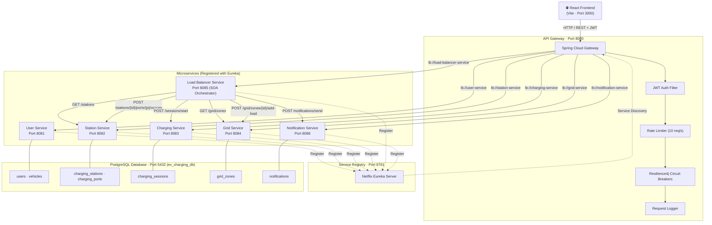
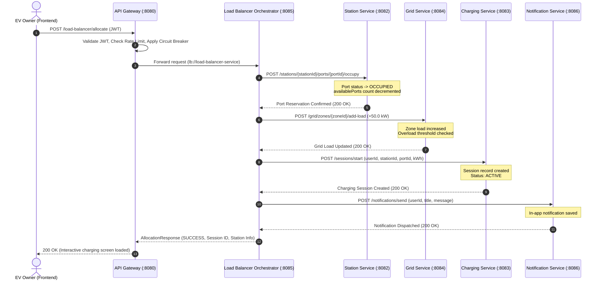

# Distributed EV Charging Station & Grid Load Balancing Platform

> **Academic Subject:** Service-Oriented Architecture (SOA) — PS046  
> **Architecture Style:** Microservices & Dynamic SOA Orchestration  
> **Backend Stack:** Java 17 (LTS), Spring Boot 3.1.5, Spring Cloud 2022.0.4 (Eureka, Gateway, Resilience4j)  
> **Database:** PostgreSQL 14+ / H2 In-Memory Fallback, Spring Data JPA  
> **Frontend Stack:** React 18 (Vite), Axios, Lucide Icons, Custom Glassmorphism UI  

---

## ⚡ Quick Start (One-Click)

To launch the complete platform (all 8 backend microservices + React frontend):

1. **Start Platform:** Double-click [`start-all.bat`](file:///d:/SOA%20PROJECT/start-all.bat) or run:
   ```cmd
   .\start-all.bat
   ```
   *The script automatically verifies JDK 17, frees ports, starts Eureka, waits for registry readiness, launches all 8 services, and opens the React frontend.*

2. **Access Web Application:**
   - **Frontend UI:** [http://localhost:3000](http://localhost:3000)
   - **Eureka Service Registry:** [http://localhost:8761](http://localhost:8761)
   - **API Gateway Entrypoint:** [http://localhost:8080](http://localhost:8080)

3. **Sample Credentials:**
   | Role | Username | Password | Privileges |
   |---|---|---|---|
   | **EV Owner** | `user` | `password123` | Smart Allocation, Port Booking, Live Session Monitor, Charging History |
   | **Grid Administrator** | `admin` | `password123` | Grid Simulator, Overload Injection (>90%), Station CRUD, Global Analytics |

4. **Stop Platform:** Double-click [`stop-all.bat`](file:///d:/SOA%20PROJECT/stop-all.bat) or run:
   ```cmd
   .\stop-all.bat
   ```
   *Cleanly terminates all background processes listening on ports `8761`, `8080`–`8086`, and `3000`.*

---

## 📄 Academic Abstract & Problem Statement

With the rapid expansion of Electric Vehicles (EVs) in urban centers, simultaneous fast-charging creates sudden power spikes that threaten power grid stability, causing localized voltage drops and transformer overloads.

This platform provides an intelligent **Service-Oriented Architecture (SOA)** solution modeled on the municipal electrical grid of **Vijayawada (5 zones, 5 stations, 24 ports)**. 

### Multi-Criteria Scoring Algorithm
When an EV driver requests charging, the central **Load Balancing Service (SOA Orchestrator)** dynamically evaluates station candidates using real-time grid telemetry:

$$\text{Score} = \frac{\text{Current Grid Zone Load (kW)}}{\text{Maximum Grid Capacity (kW)}}$$

- **Overload Threshold:** Any grid zone operating at or above **90% capacity** is flagged as `OVERLOADED`.
- **Intelligent Rerouting:** Stations within overloaded zones are automatically bypassed, and charging traffic is transparently re-routed to the closest under-utilized station with available ports.

---

## 📐 SOA Principles Demonstrated

| SOA Principle | Implementation & Evidence in Codebase |
|---|---|
| **1. Loose Coupling** | Microservices maintain independent bounded contexts and schema isolation (`users`, `charging_stations`, `grid_zones`, `charging_sessions`, `notifications`). No service directly reads or writes another service's tables. |
| **2. Formal Service Contracts** | Standardized RESTful contracts exchange typed JSON payloads with standardized HTTP response codes (`200 OK`, `201 CREATED`, `400 BAD REQUEST`, `401 UNAUTHORIZED`, `404 NOT FOUND`, `503 SERVICE UNAVAILABLE`). |
| **3. Service Composability** | The `load-balancer-service` acts as a stateless SOA Orchestrator, composing autonomous calls across Station, Grid, Charging, and Notification services into an atomic allocation flow. |
| **4. Dynamic Service Discovery** | All services register dynamically with **Netflix Eureka** (`service-registry:8761`). Services locate peers using Eureka virtual hostnames (`lb://<service-name>`) rather than hardcoded IPs or ports. |
| **5. Statelessness** | Client requests authenticate statelessly using JWT Bearer tokens validated at the API Gateway. Services maintain no HTTP session state. |
| **6. Reusability** | Independent business endpoints in `station-service` and `grid-service` can be consumed interchangeably by web SPAs, mobile applications, or third-party electrical utility systems. |
| **7. Interoperability & Abstraction** | Heterogeneous technologies (Java Spring Boot backend + React Vite frontend) communicate purely through standard HTTP/REST protocols. |

---

## 🏛 System Architecture & Topology



---

## 📋 Service Catalogue & Responsibilities

| Service | Port | Primary Responsibility | Data Entities / Tables |
|---|---|---|---|
| **Service Registry** | `8761` | Dynamic Eureka registry, heartbeat tracking (30s), instance status monitoring | *None (In-Memory)* |
| **API Gateway** | `8080` | Reverse proxy, JWT Bearer verification, token bucket rate limiting (10 req/s), Resilience4j circuit breakers | *None (Stateless)* |
| **User Service** | `8081` | Authentication, BCrypt password hashing, JWT generation, vehicle registry | `users`, `vehicles` |
| **Station Service** | `8082` | EV station inventory, port status management (AVAILABLE, OCCUPIED, MAINTENANCE) | `charging_stations`, `charging_ports` |
| **Charging Service** | `8083` | Session lifecycle (start, stop, active query), kWh telemetry, cost computation | `charging_sessions` |
| **Grid Service** | `8084` | Real-time zone capacity & load monitoring, overload detection (≥90%), manual load simulation | `grid_zones` |
| **Load Balancer** | `8085` | **SOA Orchestrator** — multi-criteria scoring algorithm, composite allocation workflow | *None (Pure Orchestrator)* |
| **Notification Service** | `8086` | User notifications dispatcher, alert history, read/unread tracking | `notifications` |
| **React Frontend** | `3000` | Responsive web SPA for EV drivers & Grid Administrators | Vite, React 18, Axios |

---

## 🔄 SOA Orchestration Workflow

The sequence below illustrates how the **Load Balancer Service** orchestrates 4 independent downstream services to complete a smart charging allocation:



---

## 🔒 Security & Resilience Architecture

### 1. API Gateway Filter Pipeline
Every request passing through the API Gateway traverses an ordered filter chain:
1. **JWT Authentication Filter (`Order -1`):** Inspects the `Authorization: Bearer <token>` header. Public endpoints (`/users/login`, `/users/register`) pass through unhindered; protected routes are checked for signature validity and expiration. Decoded user context (`X-User-Id`, `X-User-Name`, `X-User-Role`) is forwarded down-stream.
2. **Rate Limiter Filter:** In-memory token bucket enforcing an upper limit of **10 requests/sec** per client IP/user to prevent DoS attacks.
3. **Resilience4j Circuit Breakers:** Evaluates downstream service health. If any downstream service fails or times out, the gateway short-circuits calls and serves graceful fallback responses (`503 Service Unavailable`).
4. **Gateway Logging Filter (`Order 1`):** Emits structured audit logs capturing HTTP method, path, response status, and request duration.

### 2. Password Security
Passwords are hashed using **BCrypt** (cost factor 10) before storage. Plain-text credentials never enter database tables or log files.

---

## 🌐 Complete REST API Reference

### User Service (`:8081` via Gateway `/users/**`)
- `POST /users/register` — Register a new EV driver or administrator.
- `POST /users/login` — Authenticate credentials; returns JWT access and refresh tokens.
- `GET /users/{id}` — Fetch profile details for a specific user.
- `GET /users/{userId}/vehicles` — Retrieve registered electric vehicles for a user.

### Station Service (`:8082` via Gateway `/stations/**`)
- `GET /stations` — List all EV charging stations with live port counts.
- `GET /stations/{id}` — Fetch station details and individual port status.
- `POST /stations` — Create a new charging station *(Admin only)*.
- `GET /stations/{id}/availability` — Check available port count for a station.
- `POST /stations/{id}/ports/{portId}/occupy` — Reserve a specific charging port.
- `POST /stations/{id}/ports/{portId}/release` — Free an occupied port.

### Grid Monitoring Service (`:8084` via Gateway `/grid/**`)
- `GET /grid/status` — Network-wide summary: total capacity, active load, average percentage, overload count.
- `GET /grid/zones` — List all 5 Vijayawada grid zones with current metrics.
- `GET /grid/zones/{id}/load` — Fetch individual zone load and status (`NORMAL`, `HIGH_LOAD`, `OVERLOADED`).
- `PUT /grid/zones/{id}/load` — Set zone load in kW *(Admin simulation)*.
- `POST /grid/zones/{id}/add-load` — Increment zone load by specified kW.
- `POST /grid/zones/{id}/remove-load` — Decrement zone load by specified kW.

### Load Balancing Service (`:8085` via Gateway `/load-balancer/**`)
- `POST /load-balancer/select-station` — Compute grid load scores and return the ranked optimal station.
- `POST /load-balancer/allocate` — Composite orchestration: reserve port, update grid load, start session, and dispatch alert.
- `GET /load-balancer/recommendations` — Fetch quick candidate recommendations.

### Charging Session Service (`:8083` via Gateway `/sessions/**`)
- `POST /sessions/start` — Initiate a new charging session.
- `POST /sessions/stop` — Conclude an active session, compute total energy and cost, and release port.
- `GET /sessions/user/{userId}` — Retrieve full charging session history.
- `GET /sessions/user/{userId}/active` — Retrieve currently active charging session.
- `GET /sessions/stats` — Platform-wide energy and revenue statistics.

### Notification Service (`:8086` via Gateway `/notifications/**`)
- `POST /notifications/send` — Dispatch an alert notification.
- `GET /notifications/user/{userId}` — Retrieve user notifications list.
- `PUT /notifications/{id}/read` — Mark notification as read.

---

## 🎯 Demonstration Scenarios

### Scenario 1: Normal Smart Allocation
1. Log into the frontend as an EV User (`user` / `password123`).
2. Navigate to **Smart Charging** and enter target energy (e.g., `25 kWh`).
3. The Load Balancer queries Station and Grid services, calculates load scores, and selects the station in the least-loaded zone (e.g., **Mangalagiri EV Station** at 35% load).
4. Click **Confirm Charging** — port status updates, grid load increases by 50 kW, an active session begins, and an in-app confirmation notification appears.

### Scenario 2: Overload Bypass (>90% Grid Load)
1. Log in as Grid Administrator (`admin` / `password123`).
2. Open **Admin Center** -> **Interactive Grid Zone Simulator**.
3. Click **Trigger Overload (>90%)** on **Vijayawada Central (Zone 1)**. Load jumps to 94% (470 kW / 500 kW).
4. Switch back to the EV user view and request Smart Allocation.
5. **Observed Result:** Station 1 (Vijayawada Central) is flagged with an Overload Warning and bypassed. The Load Balancer intelligently reroutes the user to an alternative station with safe grid capacity.

---

## 📂 Repository Structure

```
d:\SOA PROJECT\
├── start-all.bat                       # Master one-click startup script (all services + frontend)
├── stop-all.bat                        # One-click process terminator (frees all service ports)
├── README.md                           # Master project documentation
├── database/
│   ├── schema.sql                      # Complete PostgreSQL DDL schema (7 tables)
│   └── data.sql                        # Seed data (5 Vijayawada zones, 5 stations, 24 ports)
├── service-registry/                   # Netflix Eureka Server (Port 8761)
├── api-gateway/                        # Spring Cloud Gateway & Security Filters (Port 8080)
├── user-service/                       # User Auth, Profiles, Vehicles (Port 8081)
├── station-service/                    # EV Stations & Port Catalog (Port 8082)
├── charging-service/                   # Session Lifecycle & Billing (Port 8083)
├── grid-service/                       # Grid Zone Monitoring & Simulation (Port 8084)
├── load-balancer-service/              # Core SOA Orchestrator (Port 8085)
├── notification-service/               # Alert Notification Dispatcher (Port 8086)
└── frontend/                           # React 18 (Vite) Glassmorphism Dashboard (Port 3000)
```
